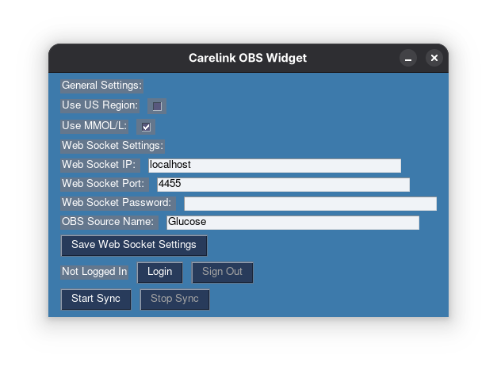

# Carelink OBS Widget

A super basic integration of the Carelink API for OBS using websocket.



## Features:
* **Automated Login**: Handles the login flow for Medtronic Carelink Cloud.
* **Region Support**: Supports both EU (default) and US regions.
* **Supports MMOL/L and MG/DL**: Built in conversion from the API MG/DL to MMOL/L

## Installation: 
1. **Clone the repository:**
    ```bash
    git clone https://github.com/AdamFinke07/Carelink-OBS-Widget
    cd Carelink-OBS-Widget
    ```

2. **Install dependencies:**
    ```bash
    pip install -r requirements.txt
    ```

3. **Install Firefox:**
    This tool requires the Firefox browser to be installed on your system to perform the authentication flow.

## Usage:

1. **Run the main application:**
    ```bash
    python main.py
    ```

2. **Login via the GUI:**
    - Configure your region settings (US/EU).
    - Click the **Login** button. A Firefox window will open.
    - Log in to your Carelink account. Once successful, the window will close automatically.

> **Note:** If the browser does not open or nothing happens, please close any existing Firefox windows and try again.

3. **Configure OBS:**
    - In OBS Studio, go to **Tools** -> **WebSocket Server Settings**. Enable the server and set a password.
    - Create a text source in your OBS scene (e.g., named `Glucose`).
    - In this application, enter your WebSocket IP, Port, Password, and the **OBS Source Name** (e.g., `Glucose`).
    - Click **Save Web Socket Settings**.

4. **Start Sync:**
    - Click **Start Sync** to begin updating the OBS text source with your glucose readings.

## TODO:
- [ ] Make the GUI less ugly
- [ ] Add trend arrow support

## Special Thanks:
* **@palmarci**: For the original implementation of the Carelink login flow.
* **@ondrej1024**: For creating the original Python library
* **@m0rt4l1n**: For the fix after recent API changes

## Disclaimer:
This project is not affiliated with Medtronic. Use at your own risk.
